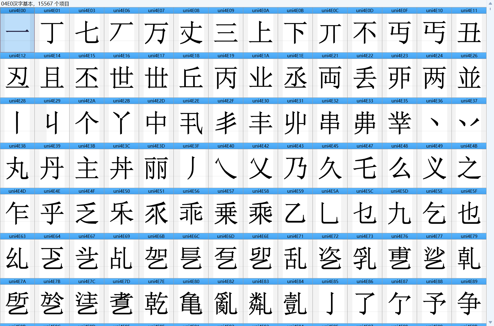
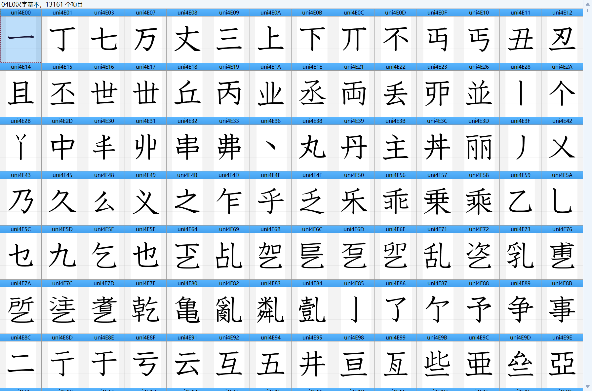
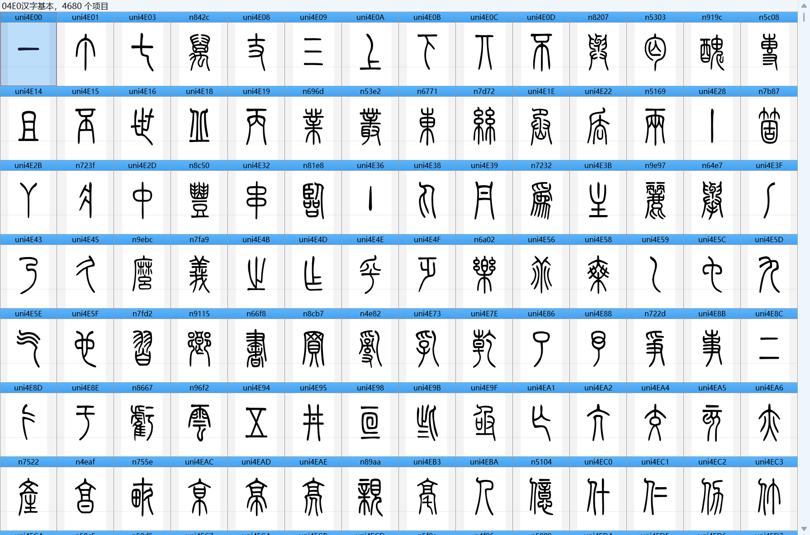

# DPR-Korea-Font-SinOkPyeon 朝鲜软件《新玉篇》内置字体
朝鲜民主主义人民共和国的安卓软件《新玉篇》（신옥편）所附带的字体。

The fonts included in the Android app "Sinokpyŏn"(신옥편) from the Democratic People's Republic of Korea.

这三款字体与此前从“红星”系统释出并广为流传的[朝鲜字体](https://github.com/REO2248/redstaros-fonts)（青峰体、光明体、千里马体等）字形不同：
1. **KPH CheongPong**，由常规的青峰体批量加粗而成。
2. **KPH Text**，类似中国楷体或日本教科书体的手写体风格。
3. **HanjaJonso**，小篆字形。

同时上述字体都存在大量生僻汉字被置于Unicode非汉字编码区间的情况。

These 3 fonts differ in glyph design from the [North Korean fonts](https://github.com/REO2248/redstaros-fonts) from Red Star OS — such as CheongPong, KwangMyeong, and CheonRiMa:
1. **KPH CheongPong** — appears to be generated by mechanically emboldening the CheongPong (청봉, 靑峯). 
2. **KPH Text** — handwritten style similar to Chinese Regular script (Kǎitǐ, 楷體) or Japanese textbook font (Kyokashotai，教科書体). 
3. **HanjaJonso** — small seal script (Xiǎozhuàn, 小篆).

Additionally, all these fonts contain numerous rare Han characters mapped to Unicode ranges not defined for CJK ideographs.

可在[Releases](https://github.com/Fisher4124/DPR-Korea-Font-SinOkPyeon/releases)页面下载字体及《新玉篇》PDF。

The fonts and the _Sinokpyŏn_ PDF can be downloaded from the [Releases](https://github.com/Fisher4124/DPR-Korea-Font-SinOkPyeon/releases).

---

[沈天珩](http://cheonhyeong.com/Simplified.html)曾以KPH CheongPong字体重构了[KPS 10721-2000](http://cheonhyeong.com/PDF/KP1-reconstitution.pdf)。

[Sim CheonHyeong](http://cheonhyeong.com/English.html) reconstructed [KPS 10721-2000](http://cheonhyeong.com/PDF/KP1-reconstitution.pdf) by the font KPH CheongPong.
